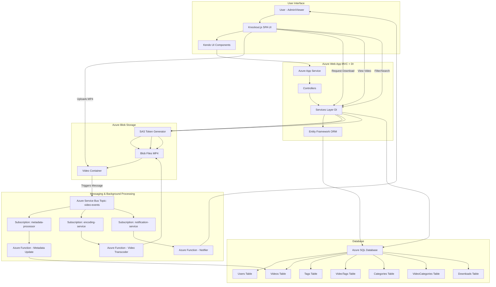

Based on your scenario—cloud-based video solution using Azure PaaS, MVC/Entity Framework, SPA with Knockout.js, Kendo UI, and secure video blob storage—here's a full breakdown of the **SQL Database Tables**, **Azure Services** (including Service Bus and Storage), and a **scenario walkthrough** that illustrates how all these components work together.

---

### 🎯 **Mermaid Architecture Diagram**




## ✅ **Solution Scenario**

**PBS Video Portal MVP** (3-month release cycle):

**Use Case**:  
End-users can:
- Upload videos (via portal interface)
- Assign tags, categories, and metadata
- Search and filter videos by title/tags/date
- View and download videos securely
- Admin users can manage video content

**Architecture:**
- **Azure App Service (PaaS)** for hosting MVC App (UI + API)
- **Azure SQL Database** for metadata
- **Azure Storage (Blob)** for storing video files
- **Azure Service Bus** for handling video upload events asynchronously (e.g., post-processing, logging)
- **Knockout.js SPA** with Kendo UI and jQuery for UI

---

## 📊 **SQL Database Tables**

Here are the core tables to support your scenario:

### 1. `Users`
```sql
CREATE TABLE Users (
    UserId INT PRIMARY KEY IDENTITY,
    Username NVARCHAR(100) NOT NULL,
    Email NVARCHAR(200),
    Role NVARCHAR(50), -- Admin, Viewer
    CreatedAt DATETIME DEFAULT GETDATE()
);
```

### 2. `Videos`
```sql
CREATE TABLE Videos (
    VideoId INT PRIMARY KEY IDENTITY,
    Title NVARCHAR(255),
    Description NVARCHAR(MAX),
    FileName NVARCHAR(255),
    BlobUrl NVARCHAR(500),
    UploadedBy INT FOREIGN KEY REFERENCES Users(UserId),
    UploadedAt DATETIME DEFAULT GETDATE(),
    FileSizeMB FLOAT,
    DurationSec INT,
    Status NVARCHAR(50), -- Pending, Processed, Failed
    IsPublic BIT
);
```

### 3. `Tags`
```sql
CREATE TABLE Tags (
    TagId INT PRIMARY KEY IDENTITY,
    Name NVARCHAR(100) UNIQUE
);
```

### 4. `VideoTags`
```sql
CREATE TABLE VideoTags (
    VideoId INT FOREIGN KEY REFERENCES Videos(VideoId),
    TagId INT FOREIGN KEY REFERENCES Tags(TagId),
    PRIMARY KEY(VideoId, TagId)
);
```

### 5. `Categories`
```sql
CREATE TABLE Categories (
    CategoryId INT PRIMARY KEY IDENTITY,
    Name NVARCHAR(100) UNIQUE
);
```

### 6. `VideoCategories`
```sql
CREATE TABLE VideoCategories (
    VideoId INT FOREIGN KEY REFERENCES Videos(VideoId),
    CategoryId INT FOREIGN KEY REFERENCES Categories(CategoryId),
    PRIMARY KEY(VideoId, CategoryId)
);
```

### 7. `Downloads`
```sql
CREATE TABLE Downloads (
    DownloadId INT PRIMARY KEY IDENTITY,
    VideoId INT FOREIGN KEY REFERENCES Videos(VideoId),
    UserId INT FOREIGN KEY REFERENCES Users(UserId),
    DownloadedAt DATETIME DEFAULT GETDATE(),
    IPAddress NVARCHAR(50)
);
```

---

## ☁️ **Azure Services Used**

### 🔷 **Azure Storage (Blob)**
- Stores video files.
- Blob URL is stored in the `Videos` table.
- Secure access via **SAS tokens** (generated per request).

### 🔷 **Azure Service Bus**
- **Topic**: `video-events`
  - Handles messages for post-upload processing (e.g., compression, encoding).
- Subscriptions:
  - `metadata-processor` (updates SQL status)
  - `encoding-service` (triggers Azure Functions to transcode video)
  - `notification-service` (sends email/push notifications)

**Sample Message Payload** (Service Bus):
```json
{
  "videoId": 123,
  "eventType": "Uploaded",
  "uploadedBy": 45,
  "blobUrl": "https://pbsstorage.blob.core.windows.net/videos/xyz.mp4"
}
```

### 🔷 **Azure App Service (Web App)**
- Hosts the MVC + Knockout.js SPA
- Implements Dependency Injection (DI) pattern for services and repositories

---

## 📷 **Sample User Scenario**

> **User Journey - Upload & Watch a Video**

1. **Login (Auth via Azure AD B2C or local auth DB)**
2. User uploads a video:
   - File stored in **Azure Blob Storage**
   - Metadata written to `Videos` table
   - Upload triggers a message to **Azure Service Bus**
3. Background services (Azure Functions) process:
   - Transcode video
   - Update `Videos.Status` to "Processed"
4. Users access the SPA UI:
   - Knockout.js + Kendo UI pull metadata from SQL
   - Video list shows thumbnails, tags, filters
5. User clicks "Watch":
   - App Service generates **SAS token** to Blob
   - Video streamed securely from Azure Blob Storage
6. User clicks "Download":
   - Secure SAS download link
   - `Downloads` table updated with user info and timestamp

---

## 🚀 Features Summary

| Feature                | Azure Service              | Details                                                                 |
|------------------------|----------------------------|-------------------------------------------------------------------------|
| File Storage           | Blob Storage               | Secure with SAS, scalable, cost-effective                              |
| Metadata Storage       | Azure SQL                  | Stores all metadata for videos, users, tags                            |
| Async Processing       | Service Bus + Azure Func   | Transcoding, logging, notification queues                              |
| Rich UI                | Knockout.js, Kendo UI      | SPA with dynamic search/filter                                         |
| Secure Access          | Blob SAS Tokens            | Temporary access, URL expiration, IP restrictions                      |
| Fast Search            | SQL + Indexing             | Fast queries by title/tag/category                                     |

---


Set Up Steps 

Creating a serverless API using Azure that leverages Service Bus to communicate with an SQL Database involves several steps. Here's a high-level overview of how you can set this up:

1. **Set Up Azure SQL Database**:
   - Create an Azure SQL Database instance.
   - Set up the necessary tables and schemas you'll need for your application.

2. **Create Azure Service Bus**:
   - Set up an Azure Service Bus namespace.
   - Within the namespace, create a queue or topic (based on your requirement).

3. **Deploy Serverless API using Azure Functions**:
   - Create a new Azure Function App.
   - Develop an HTTP-triggered function that will act as your API endpoint.
   - In this function, when data is received, send a message to the Service Bus queue or topic.

4. **Deploy 2 Service Bus Triggered Function**:
   - Create another Azure Function that is triggered by the Service Bus queue or topic.
   - This function will read the message from the Service Bus and process it. The processing might involve parsing the message and inserting the data into the Azure SQL Database.

5. **Deploy a Timer Triggered Function**:
   - Create another Azure Function that is triggered when a file is dropped in a container.
   - This function will stream in a file, read it and place on the service bus topic.

6. **Implement Error Handling**:
   - Ensure that you have error handling in place. If there's a failure in processing the message and inserting it into the database, you might want to log the error or move the message to a dead-letter queue.

7. **Secure Your Functions**:
   - Ensure that your HTTP-triggered function (API endpoint) is secured, possibly using Azure Active Directory or function keys.

8. **Optimize & Monitor**:
   - Monitor the performance of your functions using Azure Monitor and Application Insights.
   - Optimize the performance, scalability, and cost by adjusting the function's plan (Consumption Plan, Premium Plan, etc.) and tweaking the configurations.

9. **Deployment**:
   - Deploy your functions to the Azure environment. You can use CI/CD pipelines using tools like Azure DevOps or GitHub Actions for automated deployments.

By following these steps, you'll have a serverless API in Azure that uses Service Bus as a mediator to process data and store it in an SQL Database. This architecture ensures decoupling between data ingestion and processing, adding a layer of resilience and scalability to your solution.


## Appplication Setting 

|Key|Value | Comment|
|:----|:----|:----|
|AzureWebJobsStorage|[CONNECTION STRING]|RECOMMENDATION :  store in AzureKey Vault.|
|ConfigurationPath| [CONFIGURATION FOLDER PATH] |Folder is optional
|ApiKeyName|[API KEY NAME]|Will be passed in the header  :  the file name of the config.
|AppName| [APPLICATION NAME]| This is the name of the Function App, used in log analytics|
|StorageAcctName|[STORAGE ACCOUNT NAME]|Example  "AzureWebJobsStorage"|
|ServiceBusConnectionString|[SERVICE BUS CONNECTION STRING]|Example  "ServiceBusConnectionString".  Recommmended to store in Key vault.|
|DatabaseConnection|[DATABASE CONNECTION STRING]|Example  "DatabaseConnection". Recommmended to store in Key vault.|
|TimerInterval|[TIMER_INTERVAL]|Example  "0 */1 * * * *" 1 MIN|


> **Note:**  Look at the configuration file in the **Config** Folder and created a Table to record information.

## Configuration Files 

> **Note:** The **Configuration** is located in the  FunctionApp  in a **Config** Folder.

|FileName|Description|
|:----|:----|
|65D7ADCBAABC41B1B0B14A2FBBDF58F2.json| Create a user|
|7879AD00E61D4BDD8EB5805F5244A937.json| Read user information|
|A5827573F1B541F18EA226312D69134F.json| Update user information|
|0EBDA7906A644B178CB04E6ECD538C87.json| Delete a user|
|B13A8DE83A1F4E06950B023CB2521C83.json| Create a Video|
|B6015755FA424F49B36A36AC621E92C7.json| Read Video information|
|DCFCEE23C1C94739AD7079B3A365BB93.json| Update Video information|
|BF7C51E3ADDD4BE8B2266C5FAB500ABF.json| Delete a Video|
|AFCDDA2B2FBF42DEBDBCACF2B25128F4.json| Create a Tag|
|4B53AE181A214BDB9AC80D7937D1E946.json| Read Tag information|
|44EB960F55B14912A1239DC26806866E.json| Update Tag information|
|7C8FBE22BEFD404CA860876DFB4E8BA5.json| Delete a Tag|
|C266F9D8466148F2B1DAB95D18A4265C.json| Create a VideoTag|
|A90DAAD67DFA4745850C731C0493C1AE.json| Read VideoTag information|
|4E765080C6004965BFD5F86842666161.json| Update VideoTag information|
|8C432CFDED1E4279A3DDC6E3022EA885.json| Delete a VideoTag|
|FC457500EF504E22B5A289D64CBC5CED.json| Create a VideoCategory|
|5C0BA404D2B64075BCE3F43F2B979D5C.json| Read VideoCategory information|
|43096B0DFF6145DE885881230E91EA50.json| Update VideoCategory information|
|7A471E878A104AAD89B7FF26B0141FE1.json| Delete a VideoCategory|
|86302E0777EC4958AB870B51802128F8.json| Uploa a Document|
|1A9EAD13F50941CF9373092DCFBA0F2C.json| Read Document information|
|A844A9A919CE4670AAF357DCB1A07991.json| Update Document information|
|D75123247B834C21911DB263592B7970.json| Delete a Document|
|43EFE991E8614CFB9EDECF1B0FDED37F.json| **Service Bus Trigger for No SQL DB** | Receive JSON payload and insert into NO SQL DB|


> Create the following blob containers and share in azure storage

|ContainerName|Description|
|:----|:----|
|config|Location for the configuration files|
|pickup|Thes are files that are copied from the SFTP share and dropped in the pickup container |
|processed|These are files the have been parsed and dropped in th processed container|

|Table|Description|
|:----|:----|
|csvbatchfiles|Track the CSV parsed files|
|training[YYYYMMDD]|N0 SQL DataStore|


|Share|Description|
|:----|:----|
|training[YYYYMMDD]|Create a share location for SFTP to drop files|

